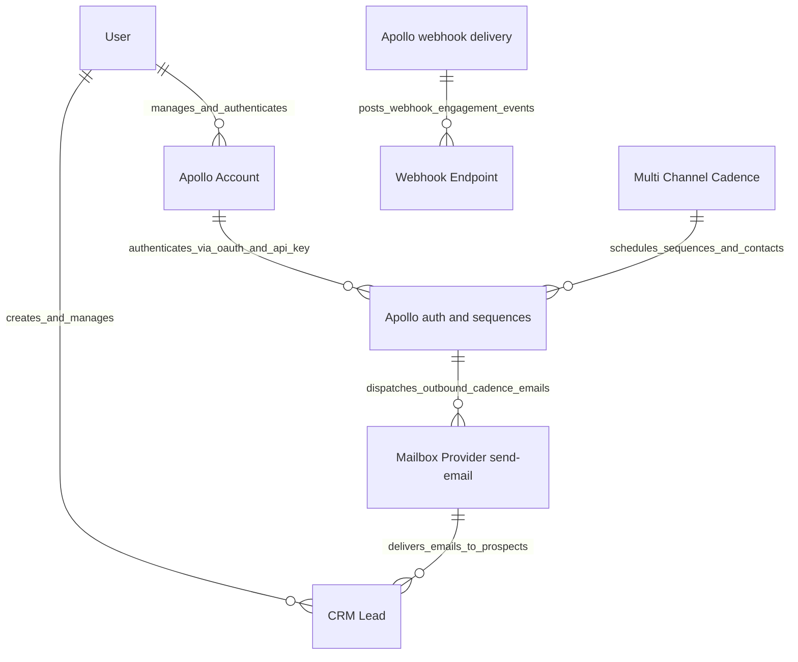

# 03 Context and Scope

This chapter describes the external interfaces and operational environment of `frappe_apollo`.

## Business & System Context

Detailed C1 Entity Relationship modeling is defined in [`c4/01-context.md`](../c4/01-context.md).

## External Interface Mapping

| Interface | Protocol | Direction | Description |
| :--- | :--- | :--- | :--- |
| **Apollo OAuth Endpoint** | HTTPS GET / POST | Outbound | Authorizes workspace accounts and exchanges authorization codes ([`apps/frappe_apollo/frappe_apollo/oauth.py`](apps/frappe_apollo/frappe_apollo/oauth.py:25)). |
| **Apollo API v1** | HTTPS REST (JSON) | Outbound | Invokes sequence creation, contact insertion, mailbox queries, and field updates ([`apps/frappe_apollo/frappe_apollo/integrations/apollo.py`](apps/frappe_apollo/frappe_apollo/integrations/apollo.py:13)). |
| **Apollo Webhook Receiver** | HTTPS POST | Inbound | Receives engagement payload notifications (`message_sent`, `message_opened`, `message_replied`, `bounce`) ([`apps/frappe_apollo/frappe_apollo/webhook.py`](apps/frappe_apollo/frappe_apollo/webhook.py:5)). |
