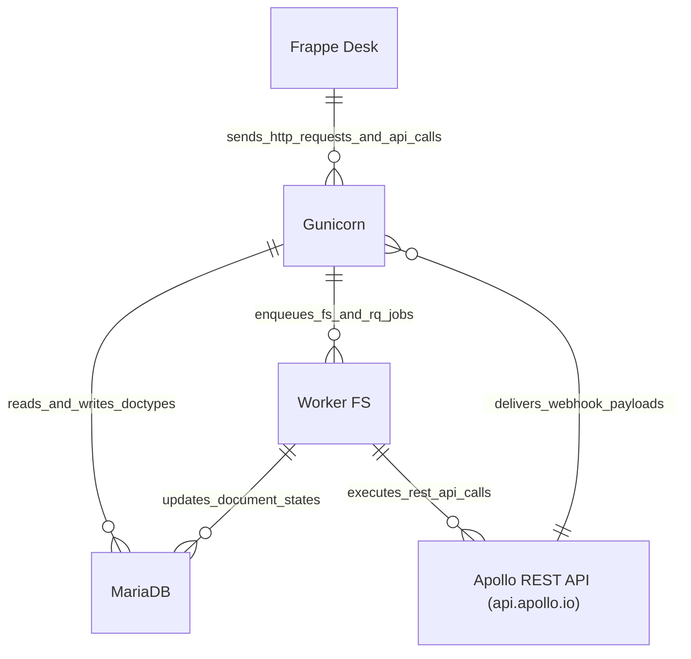
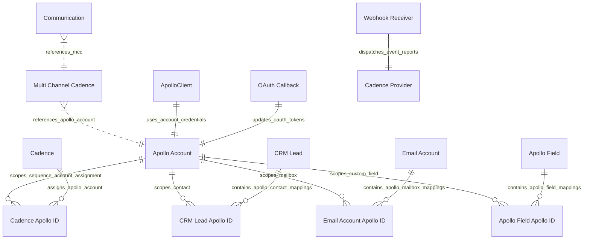

# 05 Building Block View

The Building Block View defines the static structural components of `frappe_apollo` ([`apps/frappe_apollo/frappe_apollo/hooks.py`](apps/frappe_apollo/frappe_apollo/hooks.py:1)).

## Level 1: C2 Container View

Refer to [`c4/02-container.md`](../c4/02-container.md) for full container descriptions.

## Level 2: C3 Component View

Refer to [`c4/03-component.md`](../c4/03-component.md) for individual component field definitions and relationships.

