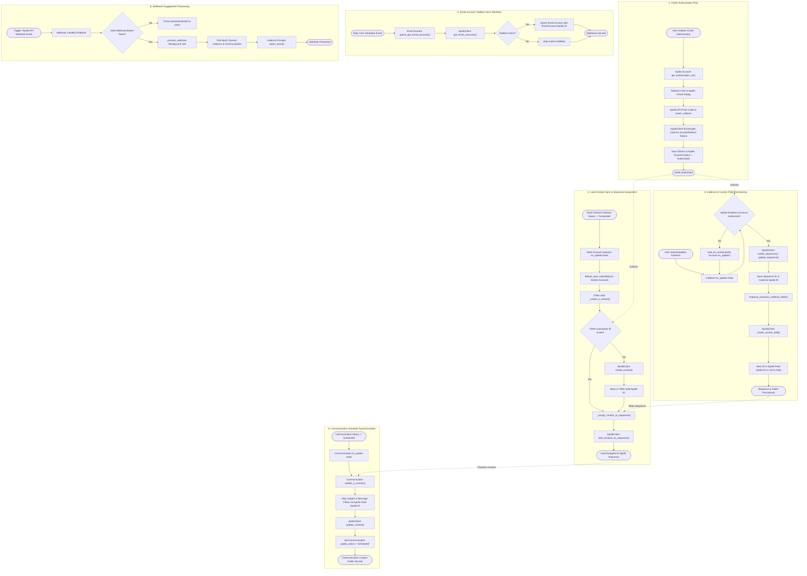

# 06 Runtime View

The Runtime View describes the behavioral interactions and event-driven workflows across `frappe_apollo` ([`apps/frappe_apollo/frappe_apollo/hooks.py`](apps/frappe_apollo/frappe_apollo/hooks.py:1)).

## Behavioral Workflows

The system's behavioral logic is structured into dedicated 1-trigger-1-file BPMN workflow models located in [`bpmn/`](../bpmn/):

1. [**OAuth Authorization Flow**](../bpmn/01-oauth-authentication.md)
2. [**Email Account / Mailbox Sync Workflow**](../bpmn/02-mailbox-sync.md)
3. [**Cadence & Custom Field Provisioning**](../bpmn/03-cadence-provisioning.md)
4. [**Lead Contact Sync & Sequence Assignment**](../bpmn/04-contact-sequence-assignment.md)
5. [**Communication Schedule Synchronization**](../bpmn/05-communication-sync.md)
6. [**Webhook Engagement Processing**](../bpmn/06-webhook-processing.md)

## Master Behavioral Graph

## Key Event Triggers & Handlers

- **OAuth State Callback**: [`frappe_apollo.oauth.callback`](apps/frappe_apollo/frappe_apollo/oauth.py:7)
- **Webhook Endpoint**: [`frappe_apollo.webhook.handle`](apps/frappe_apollo/frappe_apollo/webhook.py:5)
- **Daily Cron Sweep**: [`frappe_apollo.apollo.doctype.email_account.email_account.queue_get_email_accounts`](apps/frappe_apollo/frappe_apollo/apollo/doctype/email_account/email_account.py:4)
- **Cadence Life Cycle Hooks**: [`frappe_apollo.apollo.doctype.cadence.cadence.on_update`](apps/frappe_apollo/frappe_apollo/apollo/doctype/cadence/cadence.py:5) and [`on_trash`](apps/frappe_apollo/frappe_apollo/apollo/doctype/cadence/cadence.py:51)
- **Communication Sync Hook**: [`frappe_apollo.apollo.doctype.communication.communication.on_update`](apps/frappe_apollo/frappe_apollo/apollo/doctype/communication/communication.py:4)
