# 06 Runtime View

The Runtime View describes the behavioral interactions and event-driven workflows across `frappe_apollo` ([`apps/frappe_apollo/frappe_apollo/hooks.py`](apps/frappe_apollo/frappe_apollo/hooks.py:1)).

## Master Behavioral Graph

The system's unified behavioral logic and event-driven workflows are detailed centrally in [`[BPMN Workflows](../bpmn.md)`](../bpmn.md).

```mermaid
flowchart TD
    %% OAuth Authorization
    subgraph OAuth Auth
    StartOAuth(["User Initiates OAuth"]) --> AccountAuthUrl["Apollo Account.get_authorization_url()"]
    AccountAuthUrl --> ApolloAuthRedirect["Redirect User to Apollo OAuth Dialog"]
    ApolloAuthRedirect --> ApolloCallback["oauth_callback"]
    ApolloCallback --> TokenExchange["Exchange Code for Tokens"]
    TokenExchange --> SaveAccountToken["Save Tokens (Authorized) & Emit Event"]
    end
    
    %% Apollo Account Sequence Provisioning
    subgraph Apollo Account Provisioning
    AccountAuth(["Apollo Account -> 'Authorized'"]) --> EnqueueSeqProv["Enqueue provision_sequence()"]
    EnqueueSeqProv --> SearchSeq["ApolloClient search_sequences()"]
    SearchSeq --> CheckSearch{"Sequence Found?"}
    CheckSearch -- Yes --> SaveSeqID["Save sequence_id"]
    CheckSearch -- No --> CreateSeq["ApolloClient create_sequence()"]
    CreateSeq --> SaveSeqID
    end
    
    %% Mailbox Sync
    subgraph Mailbox Sync
    CronTrigger(["Cron Scheduler Event"]) --> QueueEmailAccounts["Email Account queue_get_email_accounts()"]
    QueueEmailAccounts --> FetchMailboxes["ApolloClient get_email_accounts()"]
    FetchMailboxes --> LoopMailboxes{"Mailbox Active?"}
    LoopMailboxes -- Yes --> UpsertEmailAccount["Upsert Email Account"]
    end

    %% Cadence Field Provisioning & Validation
    subgraph Cadence Field Provisioning
    OnUpdateCadence(["Cadence on_update"]) --> CheckApolloChannels{"Uses Apollo Channels?"}
    CheckApolloChannels -- Yes --> ValidateSeq["_validate_for_sequence()"]
    ValidateSeq --> EnqueueFieldProv["Enqueue Provision Generic Fields"]
    
    EnqueueFieldProv --> WaitFieldPrereqs["wait_for_event(Account Auth)"]
    WaitFieldPrereqs --> LoopFields["For each required step"]
    LoopFields --> CheckFieldMap{"Mapped for Account?"}
    CheckFieldMap -- No --> CreateCustomField["ApolloClient create_custom_field()"]
    CreateCustomField --> SaveFieldMap["Save ID in Apollo Field Apollo ID"]
    SaveFieldMap --> WaitSeqID["wait_for_event(Sequence ID)"]
    CheckFieldMap -- Yes --> WaitSeqID
    WaitSeqID --> CheckStepCapacity["Check Sequence step capacity"]
    CheckStepCapacity -- Missing Steps --> AppendSteps["ApolloClient update_sequence(emailer_steps)"]
    
    CadenceDisabled(["Cadence -> Disabled"]) --> EnqueueDisableMCC["Enqueue _disable_cadence_mccs()"]
    EnqueueDisableMCC --> SetMCCDisabled["Set Linked MCCs to Disabled"]
    SetMCCDisabled --> EnqueueStopContact2["Enqueue _stop_contact_in_sequence()"]
    end
    
    %% Contact Sync & Sequence Assignment
    subgraph Contact Sync & Sequence Assignment
    MCCScheduled(["Multi Channel Cadence -> 'Scheduled'"]) --> LoadBalanceAccount["before_save Load Balance Sender Accounts"]
    LoadBalanceAccount --> EnqueueAddContact["Enqueue _assign_contact_to_sequence() & _create_a_contact()"]
    
    EnqueueAddContact --> CreateContactTask["CRM Lead _create_a_contact()"]
    CreateContactTask --> WaitLeadPrereqs["wait_for_event(User Email / Account)"]
    WaitLeadPrereqs --> CheckLeadApolloID{"CRM Lead Apollo ID Exists?"}
    CheckLeadApolloID -- No --> CallCreateContactAPI["ApolloClient create_contact()"]
    CallCreateContactAPI --> SaveLeadApolloID["Store in CRM Lead Apollo ID"]
    CheckLeadApolloID -- Yes --> CallUpdateContactAPI["ApolloClient update_contact()"]
    
    EnqueueAddContact --> AssignSequence["Multi Channel Cadence _assign_contact_to_sequence()"]
    AssignSequence --> WaitMCCPrereqs["wait_for_event(Account Auth / CRM Lead Apollo ID)"]
    WaitMCCPrereqs --> AddToSeqAPI["ApolloClient add_contacts_to_sequence()"]
    
    MCCDisabled(["Multi Channel Cadence -> 'Disabled/Stopped'"]) --> EnqueueStopContact["Enqueue _stop_contact_in_sequence()"]
    EnqueueStopContact --> UpdateContactSeqStatus["ApolloClient update_contact_status_sequence()"]
    end

    %% Communication Sync
    subgraph Communication Sync
    CommScheduled(["Communication -> 'Scheduled'"]) --> EnqueueCommSync["Enqueue update_a_contact()"]
    EnqueueCommSync --> WaitCommPrereqs["wait_for_event(MCC / Account / Fields)"]
    WaitCommPrereqs --> GetDynamicIndex["Calculate Dynamic Step Index"]
    GetDynamicIndex --> PatchContactAPI["ApolloClient update_contact(custom_fields)"]
    end

    %% Webhook Processing
    subgraph Webhook Processing
    ApolloWebhook(["Apollo Webhook Event"]) --> HandleWebhook["webhook_handle()"]
    HandleWebhook --> VerifyBearerToken{"Valid Token?"}
    VerifyBearerToken -- Yes --> EnqueueProcessWebhook["process_webhook Job"]
    EnqueueProcessWebhook --> ResolveMCC["Find Multi Channel Cadence"]
    ResolveMCC --> DispatchEventReport["report_event()"]
    end
```

## Key Event Triggers & Handlers

- **OAuth State Callback**: [`frappe_apollo.oauth.callback`](apps/frappe_apollo/frappe_apollo/oauth.py:7)
- **Webhook Endpoint**: [`frappe_apollo.webhook.handle`](apps/frappe_apollo/frappe_apollo/webhook.py:5)
- **Daily Cron Sweep**: [`frappe_apollo.apollo.doctype.email_account.email_account.queue_get_email_accounts`](apps/frappe_apollo/frappe_apollo/apollo/doctype/email_account/email_account.py:4)
- **Cadence Life Cycle Hooks**: [`frappe_apollo.apollo.doctype.cadence.cadence.on_update`](apps/frappe_apollo/frappe_apollo/apollo/doctype/cadence/cadence.py:5) and [`on_trash`](apps/frappe_apollo/frappe_apollo/apollo/doctype/cadence/cadence.py:51)
- **Communication Sync Hook**: [`frappe_apollo.apollo.doctype.communication.communication.on_update`](apps/frappe_apollo/frappe_apollo/apollo/doctype/communication/communication.py:4)
