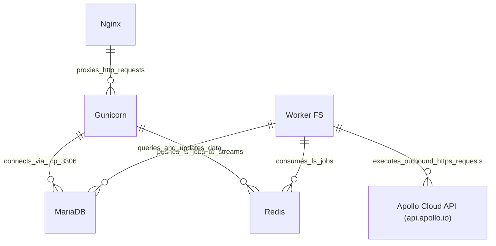

# 07 Deployment View

This chapter details the deployment topology and runtime environment for `frappe_apollo` ([`apps/frappe_apollo/pyproject.toml`](apps/frappe_apollo/pyproject.toml:1)).

## Deployment Environment

The application is deployed inside a standard Frappe Bench multi-tenant or single-tenant environment using Python 3.14 with `frappe_controller`.

### Infrastructure Nodes

## Node Descriptions

| Node | Software Component | Scaling / Topology |
| :--- | :--- | :--- |
| **Nginx** | Nginx | Port 80/443; SSL termination and static asset serving. |
| **Gunicorn** | Python 3.14 / Frappe Web Server | Multi-process WSGI handling REST endpoints and webhooks ([`apps/frappe_apollo/frappe_apollo/webhook.py`](apps/frappe_apollo/frappe_apollo/webhook.py:5)). |
| **MariaDB** | MariaDB 10.6+ | Relational persistence for DocTypes, custom fields, and `FS Job` states. |
| **Redis** | Redis Server & Streams | Caching, session state, and FastStream background job streams (`fs:queue:*`, `fs:events`) managed via `frappe_controller`. |
| **Worker FS** | Bench Worker (`bench worker --namespace fs`) | Concurrent FastStream Python processes executing enqueued API integration jobs governed by `controller_events` ([`apps/frappe_apollo/frappe_apollo/apollo/doctype/cadence/cadence.py`](apps/frappe_apollo/frappe_apollo/apollo/doctype/cadence/cadence.py:12)). |
| **Apollo Cloud API (api.apollo.io)** | Apollo.io REST Platform | External target endpoint (`https://api.apollo.io/api/v1`). |
