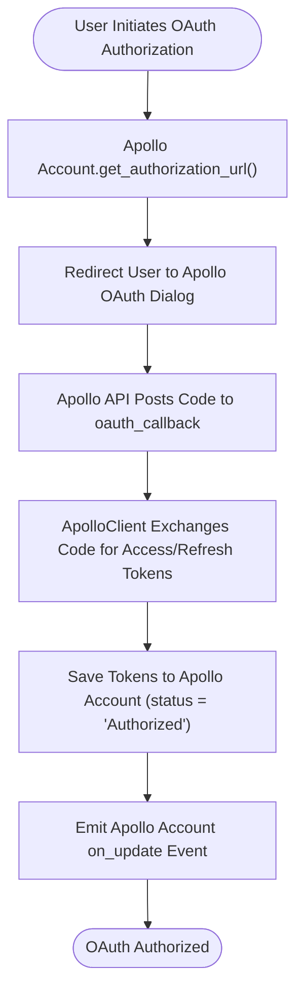
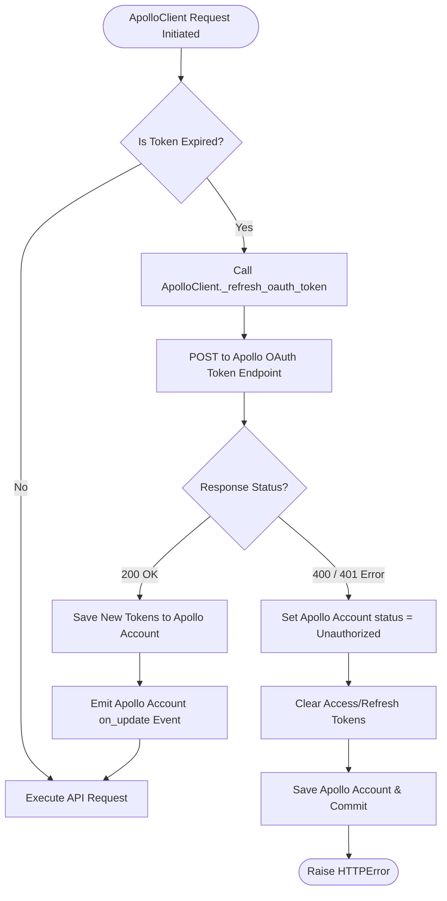

# 1. OAuth Authorization Flow

This document details the behavioral workflow for OAuth authorization with Apollo API in [`apps/frappe_apollo/frappe_apollo/hooks.py`](apps/frappe_apollo/frappe_apollo/hooks.py:1).

## Trigger
User initiates OAuth Authorization or external OAuth dialog callback to [`oauth_callback`](apps/frappe_apollo/frappe_apollo/oauth.py:7).

## Workflow Flowchart

## Token Refresh Flowchart (Auto-Refresh)

## Component References

- **Apollo Account**: [`apps/frappe_apollo/frappe_apollo/apollo/doctype/apollo_account/apollo_account.py`](apps/frappe_apollo/frappe_apollo/apollo/doctype/apollo_account/apollo_account.py:5)
- **ApolloClient**: [`apps/frappe_apollo/frappe_apollo/integrations/apollo.py`](apps/frappe_apollo/frappe_apollo/integrations/apollo.py:9)
- **oauth_callback**: [`apps/frappe_apollo/frappe_apollo/oauth.py`](apps/frappe_apollo/frappe_apollo/oauth.py:7)
