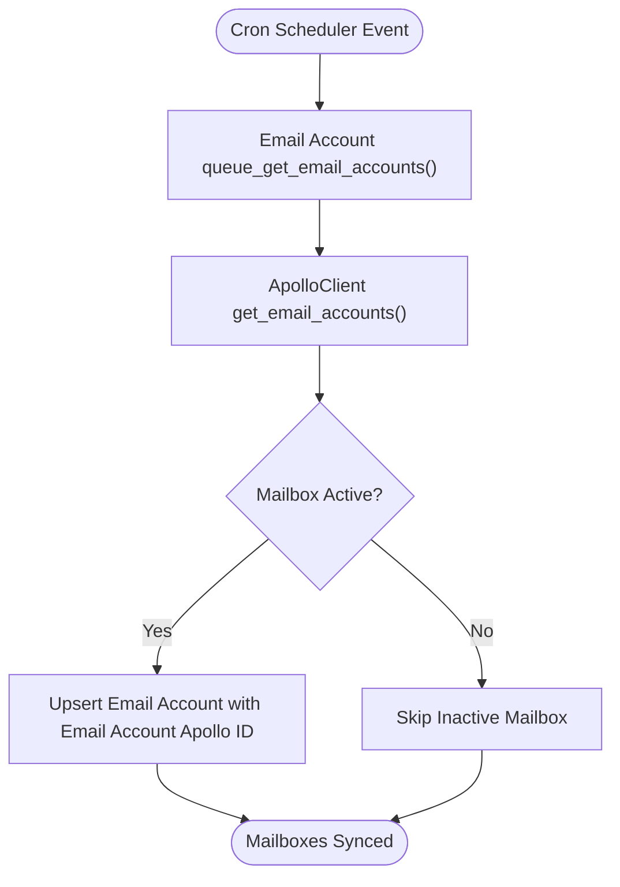

# 2. Email Account / Mailbox Sync Workflow

This document details the behavioral workflow for syncing email mailboxes from Apollo API in [`apps/frappe_apollo/frappe_apollo/hooks.py`](apps/frappe_apollo/frappe_apollo/hooks.py:1).

## Trigger
Cron Scheduler Event via [`queue_get_email_accounts`](apps/frappe_apollo/frappe_apollo/apollo/doctype/email_account/email_account.py:4).

## Workflow Flowchart

## Component References

- **Email Account**: [`apps/frappe_apollo/frappe_apollo/apollo/doctype/email_account/email_account.py`](apps/frappe_apollo/frappe_apollo/apollo/doctype/email_account/email_account.py:4)
- **Email Account Apollo ID**: [`apps/frappe_apollo/frappe_apollo/apollo/doctype/email_account_apollo_id/email_account_apollo_id.py`](apps/frappe_apollo/frappe_apollo/apollo/doctype/email_account_apollo_id/email_account_apollo_id.py:1)
- **ApolloClient**: [`apps/frappe_apollo/frappe_apollo/integrations/apollo.py`](apps/frappe_apollo/frappe_apollo/integrations/apollo.py:9)
