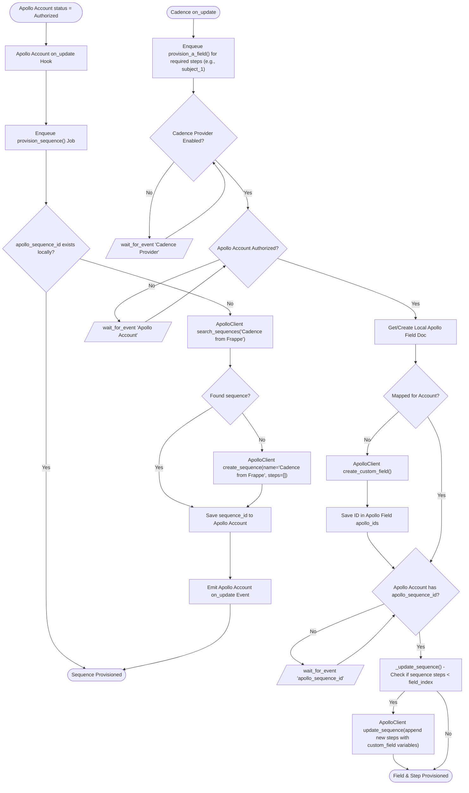

# 3. Apollo Account Sequence & Field Provisioning

This document details the behavioral workflow for provisioning the single cold-mail engine sequence and generic custom fields when an Apollo Account is authorized and Cadences are updated.

## Trigger
- Sequence Provisioning: Apollo Account is authorized (`Apollo Account on_update` where `status == Authorized`).
- Field Provisioning: A Frappe Cadence is created or updated (`Cadence on_update`).

## Workflow Flowchart

## Component References

- **Apollo Field**: [`frappe_apollo/apollo/doctype/apollo_field/apollo_field.py`](../../../frappe_apollo/apollo/doctype/apollo_field/apollo_field.py:5)
- **Apollo Account**: [`frappe_apollo/apollo/doctype/apollo_account/apollo_account.py`](../../../frappe_apollo/apollo/doctype/apollo_account/apollo_account.py:5)
- **Cadence**: [`frappe_apollo/apollo/doctype/cadence/cadence.py`](../../../frappe_apollo/apollo/doctype/cadence/cadence.py:5)
- **ApolloClient**: [`frappe_apollo/integrations/apollo.py`](../../../frappe_apollo/integrations/apollo.py:11)
