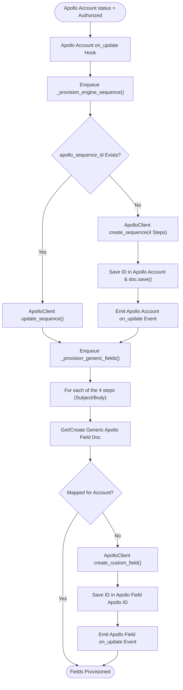

# 3. Apollo Account Sequence & Field Provisioning

This document details the behavioral workflow for provisioning the single cold-mail engine sequence and generic custom fields when an Apollo Account is authorized in [`apps/frappe_apollo/frappe_apollo/hooks.py`](apps/frappe_apollo/frappe_apollo/hooks.py:1).

## Trigger
Apollo Account is authorized via OAuth or API Key (`Apollo Account on_update` where `status == Authorized`).

## Workflow Flowchart

## Component References

- **Apollo Field**: [`apps/frappe_apollo/frappe_apollo/apollo/doctype/apollo_field/apollo_field.py`](apps/frappe_apollo/frappe_apollo/apollo/doctype/apollo_field/apollo_field.py:5)
- **Apollo Field Apollo ID**: [`apps/frappe_apollo/frappe_apollo/apollo/doctype/apollo_field_apollo_id/apollo_field_apollo_id.py`](apps/frappe_apollo/frappe_apollo/apollo/doctype/apollo_field_apollo_id/apollo_field_apollo_id.py:1)
- **Apollo Account**: [`apps/frappe_apollo/frappe_apollo/apollo/doctype/apollo_account/apollo_account.py`](apps/frappe_apollo/frappe_apollo/apollo/doctype/apollo_account/apollo_account.py:5)
- **ApolloClient**: [`apps/frappe_apollo/frappe_apollo/integrations/apollo.py`](apps/frappe_apollo/frappe_apollo/integrations/apollo.py:9)
