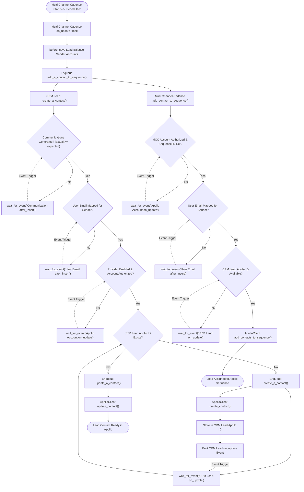

# 4. Lead Contact Sync & Sequence Assignment

This document details the behavioral workflow for creating lead contacts in Apollo and assigning them to sequences in [`apps/frappe_apollo/frappe_apollo/hooks.py`](apps/frappe_apollo/frappe_apollo/hooks.py:1).

## Trigger
Multi Channel Cadence status updated to `'Scheduled'` (`Multi Channel Cadence on_update`).

## Workflow Flowchart

## Component References

- **Multi Channel Cadence**: [`apps/frappe_apollo/frappe_apollo/apollo/doctype/multi_channel_cadence/multi_channel_cadence.py`](apps/frappe_apollo/frappe_apollo/apollo/doctype/multi_channel_cadence/multi_channel_cadence.py:5)
- **CRM Lead**: [`apps/frappe_apollo/frappe_apollo/apollo/doctype/crm_lead/crm_lead.py`](apps/frappe_apollo/frappe_apollo/apollo/doctype/crm_lead/crm_lead.py:3)
- **CRM Lead Apollo ID**: [`apps/frappe_apollo/frappe_apollo/apollo/doctype/crm_lead_apollo_id/crm_lead_apollo_id.py`](apps/frappe_apollo/frappe_apollo/apollo/doctype/crm_lead_apollo_id/crm_lead_apollo_id.py:1)
- **Communication**: [`apps/frappe_apollo/frappe_apollo/apollo/doctype/communication/communication.py`](apps/frappe_apollo/frappe_apollo/apollo/doctype/communication/communication.py:4)
- **Apollo Account**: [`apps/frappe_apollo/frappe_apollo/apollo/doctype/apollo_account/apollo_account.py`](apps/frappe_apollo/frappe_apollo/apollo/doctype/apollo_account/apollo_account.py:5)
- **ApolloClient**: [`apps/frappe_apollo/frappe_apollo/integrations/apollo.py`](apps/frappe_apollo/frappe_apollo/integrations/apollo.py:9)
