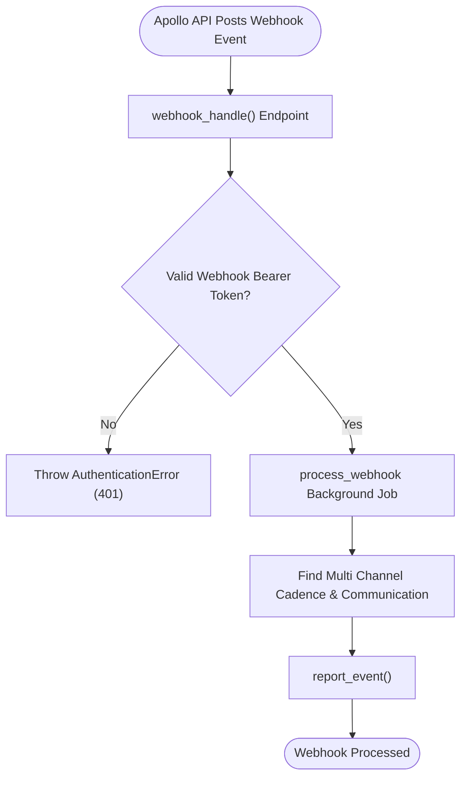

# 6. Webhook Engagement Processing

This document details the behavioral workflow for receiving and processing external Apollo webhook engagement events in [`apps/frappe_apollo/frappe_apollo/hooks.py`](apps/frappe_apollo/frappe_apollo/hooks.py:1).

## Trigger
Apollo API posts webhook event to [`webhook_handle`](apps/frappe_apollo/frappe_apollo/webhook.py:5) endpoint.

## Workflow Flowchart

## Component References

- **webhook_handle**: [`apps/frappe_apollo/frappe_apollo/webhook.py`](apps/frappe_apollo/frappe_apollo/webhook.py:5)
- **Cadence Provider / Report Event**: [`apps/frappe_cadence/frappe_cadence/cadence/doctype/cadence_provider/cadence_provider.py`](apps/frappe_cadence/frappe_cadence/cadence/doctype/cadence_provider/cadence_provider.py:1)
- **Multi Channel Cadence**: [`apps/frappe_apollo/frappe_apollo/apollo/doctype/multi_channel_cadence/multi_channel_cadence.py`](apps/frappe_apollo/frappe_apollo/apollo/doctype/multi_channel_cadence/multi_channel_cadence.py:5)
- **Communication**: [`apps/frappe_apollo/frappe_apollo/apollo/doctype/communication/communication.py`](apps/frappe_apollo/frappe_apollo/apollo/doctype/communication/communication.py:4)
