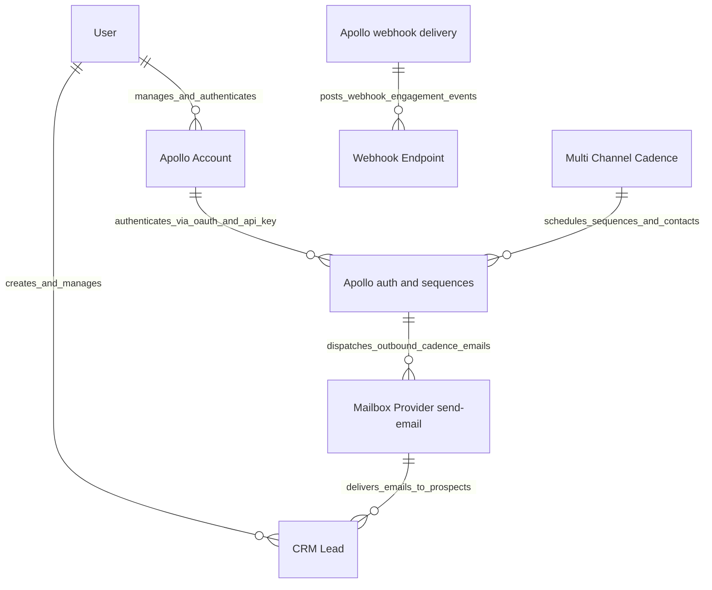

# C1 System Context Model

This document defines the C1 System Context for the [`apps/frappe_apollo/frappe_apollo/hooks.py`](apps/frappe_apollo/frappe_apollo/hooks.py:1) application within the Frappe ecosystem.

## Context Diagram

## Entity Descriptions

| Entity Name | Description | Framework Scope |
| :--- | :--- | :--- |
| `User` | Sales representative or system administrator operating Frappe CRM. | Core Frappe |
| `Apollo Account` | Stores Apollo authentication credentials (API key, OAuth tokens). | [`apps/frappe_apollo/frappe_apollo/apollo/doctype/apollo_account/apollo_account.py`](apps/frappe_apollo/frappe_apollo/apollo/doctype/apollo_account/apollo_account.py:5) |
| `CRM Lead` | Lead document containing prospect details, synchronized with Apollo contacts. | `crm` App |
| `Multi Channel Cadence` | Outreach cadence instance orchestrating sequence runs. | [`apps/frappe_apollo/frappe_apollo/apollo/doctype/multi_channel_cadence/multi_channel_cadence.py`](apps/frappe_apollo/frappe_apollo/apollo/doctype/multi_channel_cadence/multi_channel_cadence.py:5) |
| `"Apollo auth and sequences"` | Apollo.io REST API endpoint (`https://api.apollo.io/api/v1`). | External SaaS |
| `"Mailbox Provider send-email"` | Mailbox provider (Google Workspace / Office 365) linked to Apollo mailboxes. | External Service |
| `Webhook Endpoint` | Public HTTP endpoint processing inbound engagement hooks from Apollo. | [`apps/frappe_apollo/frappe_apollo/webhook.py`](apps/frappe_apollo/frappe_apollo/webhook.py:5) |
