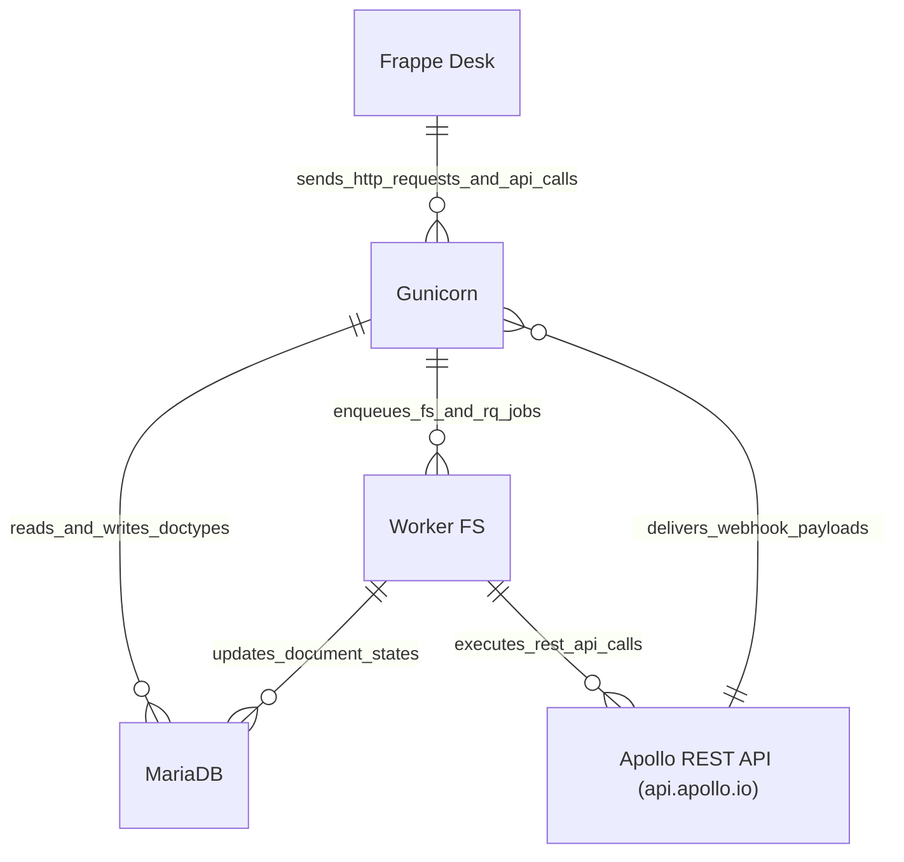

# C2 Container Architecture Model

This document defines the C2 Container diagram for [`apps/frappe_apollo/frappe_apollo/hooks.py`](apps/frappe_apollo/frappe_apollo/hooks.py:1) and its infrastructural dependencies.

## Container Diagram

## Container Specifications

| Container | Technology / Protocol | Purpose / Responsibility |
| :--- | :--- | :--- |
| `Frappe Desk` | Browser, JS (Vue/Frappe JS) | Web interface for configuring Apollo Accounts, Cadences, and CRM Leads. |
| `Gunicorn` | Python 3.14, Frappe Web Server / WSGI | Handles REST controllers, OAuth endpoints ([`apps/frappe_apollo/frappe_apollo/oauth.py`](apps/frappe_apollo/frappe_apollo/oauth.py:7)), and webhooks ([`apps/frappe_apollo/frappe_apollo/webhook.py`](apps/frappe_apollo/frappe_apollo/webhook.py:5)). |
| `MariaDB` | MariaDB / InnoDB | Persists DocTypes (`Apollo Account`, `Apollo Field`, `Communication`, `CRM Lead`, `FS Job`, etc.). |
| `Worker FS` | Redis Streams, FastStream & Bench Workers | Asynchronously processes background tasks like contact synchronization, field mapping, and webhook payloads via `frappe.enqueue()` and `frappe_controller.utils.background_jobs.enqueue()` ([`apps/frappe_apollo/frappe_apollo/apollo/doctype/cadence/cadence.py`](apps/frappe_apollo/frappe_apollo/apollo/doctype/cadence/cadence.py:3)). |
| `Apollo REST API (api.apollo.io)` | HTTPS REST (JSON) | Apollo.io external service endpoints (`https://api.apollo.io/api/v1`). |
