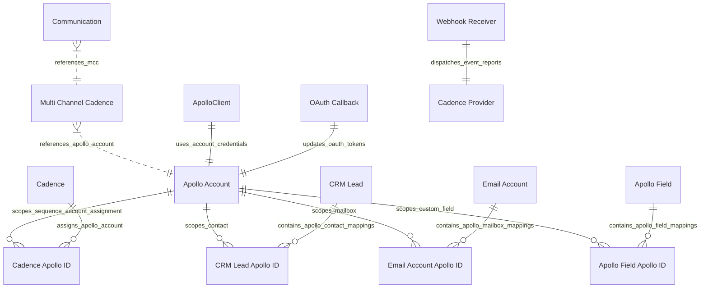

# C3 Component Architecture & Entity Model

This document defines the C3 Component ERD model for [`apps/frappe_apollo/frappe_apollo/hooks.py`](apps/frappe_apollo/frappe_apollo/hooks.py:1).

## Component & Entity Relationship Diagram

## Component Detailed Specifications

### 1. Core Apollo DocTypes & Child Tables

#### `Apollo Account`
- **File**: [`apps/frappe_apollo/frappe_apollo/apollo/doctype/apollo_account/apollo_account.py`](apps/frappe_apollo/frappe_apollo/apollo/doctype/apollo_account/apollo_account.py:5)
- **Primary Key**: `account_name` (Data, Unique, In List View)
- **Attributes**:
  - `status`: Select (`Authorized`, `Unauthorized`, Hidden in Form, In List View)
  - `api_key`: Password
  - `client_id`: Data
  - `client_secret`: Password
  - `refresh_token`: Password (Hidden)
  - `access_token`: Password (Hidden)
  - `expired`: Datetime (Read Only, Hidden)
  - `webhook_bearer_token`: Password
  - `apollo_sequence_id`: Data

#### `Cadence Apollo ID`
- **File**: [`apps/frappe_apollo/frappe_apollo/apollo/doctype/cadence_apollo_id/cadence_apollo_id.py`](apps/frappe_apollo/frappe_apollo/apollo/doctype/cadence_apollo_id/cadence_apollo_id.py:1)
- **Type**: Child Table (`istable: 1`) attached to `Cadence`
- **Attributes**:
  - `account`: Link -> `Apollo Account`
  - `sender`: Link -> `User`
  - `status`: Select (`Active`, `Inactive`)

#### `CRM Lead Apollo ID`
- **File**: [`apps/frappe_apollo/frappe_apollo/apollo/doctype/crm_lead_apollo_id/crm_lead_apollo_id.py`](apps/frappe_apollo/frappe_apollo/apollo/doctype/crm_lead_apollo_id/crm_lead_apollo_id.py:1)
- **Type**: Child Table (`istable: 1`) attached to `CRM Lead`
- **Attributes**:
  - `account`: Link -> `Apollo Account`
  - `apollo_id`: Data (Apollo Contact ID)

#### `Email Account Apollo ID`
- **File**: [`apps/frappe_apollo/frappe_apollo/apollo/doctype/email_account_apollo_id/email_account_apollo_id.py`](apps/frappe_apollo/frappe_apollo/apollo/doctype/email_account_apollo_id/email_account_apollo_id.py:1)
- **Type**: Child Table (`istable: 1`) attached to `Email Account`
- **Attributes**:
  - `account`: Link -> `Apollo Account`
  - `apollo_id`: Data (Apollo Mailbox / Email Account ID)

#### `Apollo Field`
- **File**: [`apps/frappe_apollo/frappe_apollo/apollo/doctype/apollo_field/apollo_field.py`](apps/frappe_apollo/frappe_apollo/apollo/doctype/apollo_field/apollo_field.py:5)
- **Primary Key**: `label` (Data)
- **Attributes**:
  - `label`: Data
  - `apollo_ids`: Table -> `Apollo Field Apollo ID`

#### `Apollo Field Apollo ID`
- **File**: [`apps/frappe_apollo/frappe_apollo/apollo/doctype/apollo_field_apollo_id/apollo_field_apollo_id.py`](apps/frappe_apollo/frappe_apollo/apollo/doctype/apollo_field_apollo_id/apollo_field_apollo_id.py:1)
- **Type**: Child Table (`istable: 1`) attached to `Apollo Field`
- **Attributes**:
  - `account`: Link -> `Apollo Account`
  - `apollo_id`: Data (Apollo Custom Field ID)

### 2. Provider Integration & API Client

#### Native Event Handlers (`doc_events`)
- **File**: [`apps/frappe_apollo/frappe_apollo/hooks.py`](apps/frappe_apollo/frappe_apollo/hooks.py:135)
- **Integration**: Subscribes directly to Frappe's native `doc_events` for `Cadence`, `Cadence Provider`, `Communication`, and `Multi Channel Cadence`, eliminating custom hook registries.

#### `ApolloClient`
- **File**: [`apps/frappe_apollo/frappe_apollo/integrations/apollo.py`](apps/frappe_apollo/frappe_apollo/integrations/apollo.py:9)
- **Key Methods**:
  - [`get_email_accounts()`](apps/frappe_apollo/frappe_apollo/integrations/apollo.py:15)
  - [`search_sequences()`](apps/frappe_apollo/frappe_apollo/integrations/apollo.py:18)
  - [`create_sequence()`](apps/frappe_apollo/frappe_apollo/integrations/apollo.py:27)
  - [`update_sequence()`](apps/frappe_apollo/frappe_apollo/integrations/apollo.py:38)
  - [`approve_sequence()`](apps/frappe_apollo/frappe_apollo/integrations/apollo.py:41)
  - [`abort_sequence()`](apps/frappe_apollo/frappe_apollo/integrations/apollo.py:44)
  - [`archive_sequence()`](apps/frappe_apollo/frappe_apollo/integrations/apollo.py:47)
  - [`create_contact()`](apps/frappe_apollo/frappe_apollo/integrations/apollo.py:50)
  - [`update_contact()`](apps/frappe_apollo/frappe_apollo/integrations/apollo.py:56)
  - [`add_contacts_to_sequence()`](apps/frappe_apollo/frappe_apollo/integrations/apollo.py:60)
  - [`create_custom_field()`](apps/frappe_apollo/frappe_apollo/integrations/apollo.py:75)
  - [`update_sequence_contact_status()`](apps/frappe_apollo/frappe_apollo/integrations/apollo.py:83)

### 3. HTTP Endpoints

#### `oauth_callback`
- **File**: [`apps/frappe_apollo/frappe_apollo/oauth.py`](apps/frappe_apollo/frappe_apollo/oauth.py:7)
- **Route**: `/api/method/frappe_apollo.oauth.callback`
- **Parameters**: `code`, `state` (Apollo Account Name)

#### `webhook_handle`
- **File**: [`apps/frappe_apollo/frappe_apollo/webhook.py`](apps/frappe_apollo/frappe_apollo/webhook.py:5)
- **Route**: `/api/method/frappe_apollo.webhook.handle`
- **Auth**: Bearer token checked against `Apollo Account.webhook_bearer_token`

### 4. Setup & Lifecycle Hooks

#### `after_install`
- **File**: [`apps/frappe_apollo/frappe_apollo/install.py`](apps/frappe_apollo/frappe_apollo/install.py:6)
- **Hook**: `after_install` in [`hooks.py`](apps/frappe_apollo/frappe_apollo/hooks.py:89)
- **Behavior**: Verifies the existence of the `Cadence Provider` DocType and automatically provisions the `"Apollo"` provider record mapped to the `"Email"` channel.

#### `before_uninstall`
- **File**: [`apps/frappe_apollo/frappe_apollo/uninstall.py`](apps/frappe_apollo/frappe_apollo/uninstall.py:6)
- **Hook**: `before_uninstall` in [`hooks.py`](apps/frappe_apollo/frappe_apollo/hooks.py:94)
- **Behavior**: Cleans up and removes the `"Apollo"` `Cadence Provider` document and its child records upon application removal.
